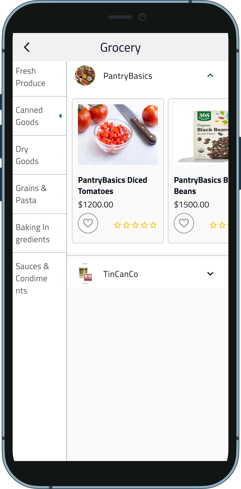
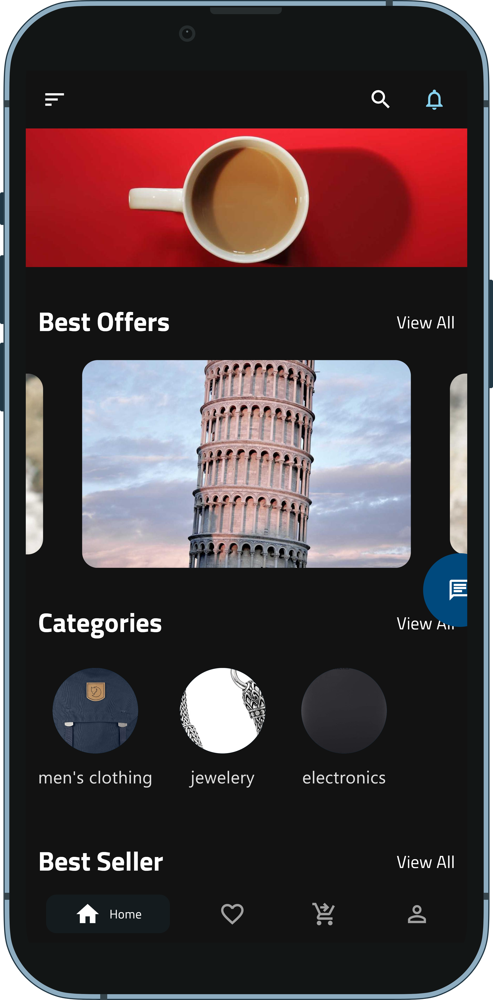

# AMA E-COMMERCE

    
    <h1 style="font-size: 28px;">Welcome to AMA E-COMMERCE</h1>

Welcome to AMA E-COMMERCE, your one-stop solution for all your shopping needs. Discover a wide range of products, enjoy seamless shopping experiences, and benefit from our top-notch customer service.

---
## Download the App

[Download Latest APK](https://github.com/abdo6400/ama-E-commerce/actions/runs/{latest_run_id}/artifacts)

## Description

Welcome to AMA E-COMMERCE, your one-stop solution for all your shopping needs. Discover a wide range of products, enjoy seamless shopping experiences, and benefit from our top-notch customer service.

---

## App Features

- User-friendly interface
- Secure payment options
- Order tracking
- Wishlist and Favorites
- Push notifications for offers and updates
- 24/7 customer support

---

## App Screenshots

 
    
    
    
    
    
    
    

---

## App Packages

