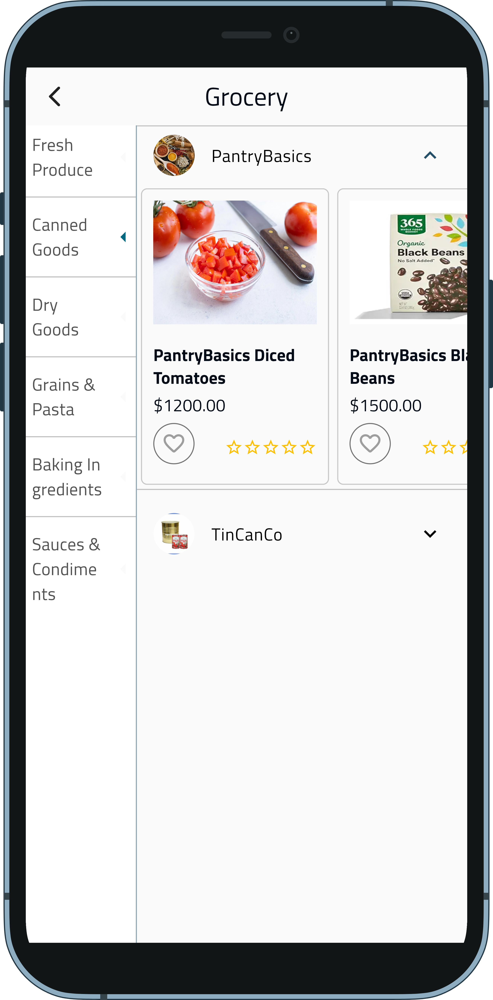

# AMA E-COMMERCE

    
    <h1 style="font-size: 28px;">Welcome to AMA E-COMMERCE</h1>

Welcome to AMA E-COMMERCE, your one-stop solution for all your shopping needs. Discover a wide range of products, enjoy seamless shopping experiences, and benefit from our top-notch customer service.

---
## Download the App

[Download Latest APK](https://github.com/abdo6400/ama-E-commerce/actions/runs/{latest_run_id}/artifacts)

## Description

Our comprehensive e-commerce platform is designed to streamline the shopping and delivery experience. It features two distinct applications, each tailored to meet the needs of our users and delivery personnel.

## User App
The User App is a feature-rich application that provides customers with a seamless and intuitive shopping experience. Key features include:

User-Friendly Interface: Easy navigation and a clean layout make browsing and purchasing a breeze.
Product Search and Filters: Advanced search capabilities and filters help users quickly find the products they need.
Personalized Recommendations: Smart algorithms suggest products based on user preferences and shopping history.
Secure Payments: Multiple payment options, including credit cards, digital wallets, and more, ensure secure transactions.
Order Tracking: Real-time updates on order status, from purchase to delivery.
Wishlist and Favorites: Users can save their favorite products for future reference.
Customer Support: In-app support options, including chat and email, for quick resolution of issues.
## Delivery Man App
The Delivery Man App is designed to optimize the efficiency of our delivery personnel, ensuring timely and accurate deliveries. Key features include:

Order Management: Easy access to assigned orders with detailed information on pickup and delivery locations.
Navigation Assistance: Integrated maps and GPS for efficient route planning and navigation.
Real-Time Updates: Instant notifications for new orders, cancellations, and important updates.
Proof of Delivery: Options to capture digital signatures and photos to confirm successful deliveries.
Earnings Tracking: Detailed records of completed deliveries and earnings for transparent financial management.
In-App Communication: Direct messaging with customers and support for smooth coordination.
Our dual-app approach ensures that both customers and delivery personnel have the tools they need for a superior e-commerce experience. Whether you're shopping for the latest products or delivering them, our platform is designed to make the process efficient, secure, and enjoyable.

---

## App Features

- User-friendly interface
- Secure payment options
- Order tracking
- Wishlist and Favorites
- Push notifications for offers and updates
- 24/7 customer support

---

## App Screenshots

 
    
    
    
    
    
    
    

---

## App Packages

